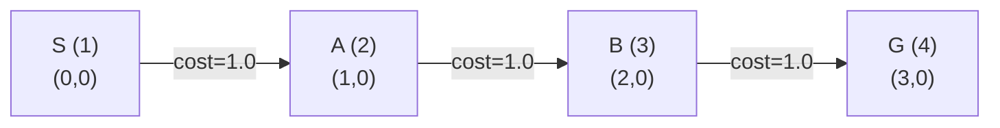
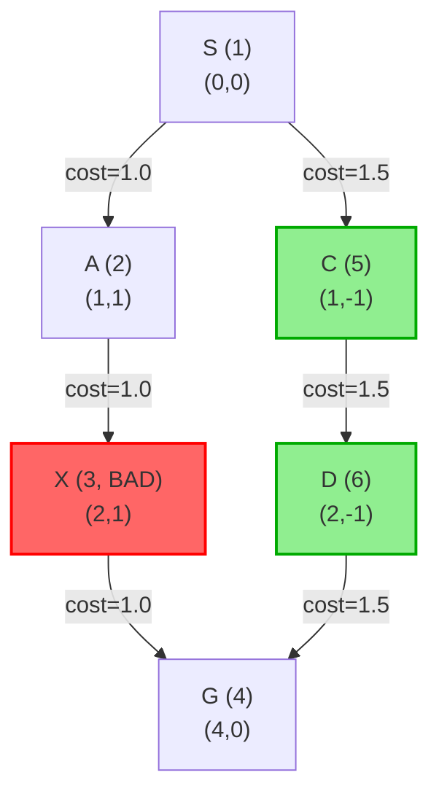
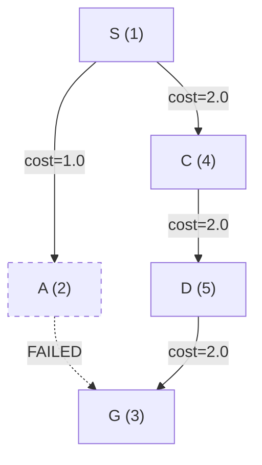
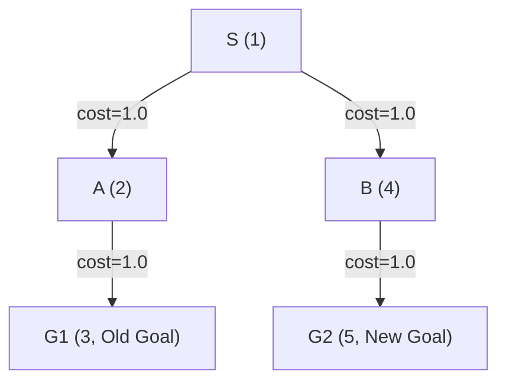

# PCCST503 – Machine Learning | Assignment 1
# Demonstration: Test Cases & Interactive CLI Walkthrough

**Department of Computer Science and Engineering**  
**Course Code:** PCCST503 — Machine Learning  
**Assignment:** Design of a Safe Semantic Planner in a Finite Cartesian State Space  
**Author:** Nandana Sasikumar (TCR24CS050)
**Implementation Language:** C++17  

---

## 1. Overview

This document provides a comprehensive demonstration of the **Safe Cartesian State Space Planner (LPA\*)**, verifying correct execution across:
1. **The Six Canonical Test Cases** defined in the assignment specification (Pages 4–5).
2. **An End-to-End Interactive CLI Session** demonstrating live graph perturbations, edge failures, dynamic shortcut additions, obstacle injections, and instantaneous goal switching.

---

## 2. Canonical Test Cases Walkthrough

### 2.1 Test Case 1: Basic Reachability

#### Objective
Verify that the planner correctly discovers the unique linear path in an obstacle-free Cartesian state space.



#### Problem Configuration
- **Initial State:** `1 (0, 0)` | **Goal State:** `4 (3, 0)`
- **Bad States:** None (`{}`)
- **Transitions:** `101: 1->2 (cost=1)`, `102: 2->3 (cost=1)`, `103: 3->4 (cost=1)`

#### Execution & Verification
- **Expected Result:** Unique valid path `1 -> 2 -> 3 -> 4`, total cost $= 3.0$.
- **Actual Output:**
  ```text
  [TC1 Basic reachability] path: 1 -> 2 -> 3 -> 4 | cost=3 | minDistToBadState=1000000.00
  ```
- **Validation:** **PASSED.** Path matches ground truth with exact cost $3.00$.

---

### 2.2 Test Case 2: Bad State Avoidance

#### Objective
Verify that the planner avoids paths traversing hazardous bad states and automatically routes through a safe alternative path.



#### Problem Configuration
- **Initial State:** `1 (0, 0)` | **Goal State:** `4 (4, 0)`
- **Bad States:** `{3}` (State 3 at coordinate `(2, 1)`)
- **Transitions:**
  - Branch 1 (Hazardous): `201: 1->2 (1.0)`, `202: 2->3 (1.0)`, `203: 3->4 (1.0)` (Total cost $3.0$)
  - Branch 2 (Safe): `204: 1->5 (1.5)`, `205: 5->6 (1.5)`, `206: 6->4 (1.5)` (Total cost $4.5$)

#### Execution & Verification
- **Expected Result:** Prune Branch 1; select safe detour `1 -> 5 -> 6 -> 4` with total cost $4.50$.
- **Actual Output:**
  ```text
  [TC2 Bad state avoidance] path: 1 -> 5 -> 6 -> 4 | cost=4.50 | minDistToBadState=2.00
  ```
- **Validation:** **PASSED.** Zero bad states visited. Minimum distance to bad state $= 2.00$ units.

---

### 2.3 Test Case 3: Safety Margin & Trade-off Tuning

#### Objective
Demonstrate that the planner can balance raw transition cost against spatial proximity to bad states based on the safety weight parameter $\gamma$.

```
  Y ↑
    │   [5] (1,3) ──────────────► [6] (2,3)       Safe Path (Cost = 6.0, Clearance = 1.50)
  3 ┤    ▲                          │
    │    │                          ▼
    │   [1] (0,0) ──────────────► [4] (3,0)       (Start = 1, Goal = 4)
    │    │                          ▲
0.1 ┤   [2] (1,0.1) ────────────► [3] (2,0.1)     Cheap Path (Cost = 3.0, Clearance = 0.51)
    │             [99, BAD] (1.5, 0)
    └────┴─────────┴─────────┴─────┴─────────► X
         0         1        1.5    2         3
```

#### Problem Configuration
- **Initial State:** `1 (0, 0)` | **Goal State:** `4 (3, 0)`
- **Bad State:** `99 (1.5, 0)`
- **Path 1 (Cheap, Near Hazard):** $1 \to 2 \to 3 \to 4$ (Raw cost $3.0$, clearance $0.51$)
- **Path 2 (Expensive, Far Clearance):** $1 \to 5 \to 6 \to 4$ (Raw cost $6.0$, clearance $1.50$)

#### Execution & Verification
```text
[TC3 Safety margin (safety-weighted)] path: 1 -> 5 -> 6 -> 4 | cost=6.00 | minDistToBadState=1.50
[TC3 Safety margin (cost-only)]       path: 1 -> 2 -> 3 -> 4 | cost=3.00 | minDistToBadState=0.51
```
- **Validation:** **PASSED.** When safety weighting is active ($\gamma = 5.0$), the planner chooses the wide clearance path ($1.50$). When safety is unweighted ($\gamma = 0.0$), it picks the cheaper direct route ($3.00$).

---

### 2.4 Test Case 4: Dynamic Transition Failure & Incremental Replanning

#### Objective
Demonstrate dynamic adaptation when an active transition drops out during execution.



#### Problem Configuration & Dynamic Action
1. **Initial State:** `1` | **Goal State:** `3`
2. **Initial Plan:** Primary route `1 -> 2 -> 3` (Cost $2.0$).
3. **Perturbation:** Transition `402: (2 -> 3)` is deactivated (`available = false`).

#### Execution & Verification
```text
[TC4 Before edge removal] path: 1 -> 2 -> 3 | cost=2.00 | minDistToBadState=1000000.00
[TC4 After edge removal (replanned)] path: 1 -> 4 -> 5 -> 3 | cost=6.00 | minDistToBadState=1000000.00
        LPA* expansions triggered by this single update: 2
```
- **Validation:** **PASSED.** Planner reroutes to `1 -> 4 -> 5 -> 3` with cost $6.00$. LPA* recomputed the trajectory in **only 2 expansions**.

---

### 2.5 Test Case 5: Mid-Execution Goal Update

#### Objective
Demonstrate that the planner can update the goal state mid-execution with zero replanning overhead ($O(1)$ lookup).



#### Problem Configuration & Dynamic Action
1. **Initial State:** `1` | **Goal State:** `3`
2. **Initial Plan:** `1 -> 2 -> 3` (Cost $2.0$).
3. **Perturbation:** Goal updated to state `5` via `setGoal(5)`.

#### Execution & Verification
```text
[TC5 Original goal (3)] path: 1 -> 2 -> 3 | cost=2.00 | minDistToBadState=1000000.00
[TC5 Updated goal (5), zero replanning] path: 1 -> 4 -> 5 | cost=2.00 | minDistToBadState=1000000.00
```
- **Validation:** **PASSED.** Path to new goal `1 -> 4 -> 5` extracted instantaneously with **0 expansions** and **0.0 ms** replanning delay.

---

### 2.6 Test Case 6: Transition Addition (Shortcut Insertion)

#### Objective
Verify that the planner dynamically detects and incorporates newly added shortcut transitions.

```mermaid
graph LR
    S["S (1)"] -->|cost=1.0| A["A (2)"]
    A -->|cost=1.0| B["B (3)"]
    B -->|cost=1.0| G["G (4)"]
    
    S ==>|NEW SHORTCUT (cost=1.2)| G
```

#### Problem Configuration & Dynamic Action
1. **Initial Path:** `1 -> 2 -> 3 -> 4` (Cost $3.0$).
2. **Perturbation:** A direct shortcut transition `604: (1 -> 4)` with cost $1.20$ is inserted.

#### Execution & Verification
```text
[TC6 Before shortcut] path: 1 -> 2 -> 3 -> 4 | cost=3.00 | minDistToBadState=1000000.00
[TC6 After shortcut added (replanned)] path: 1 -> 4 | cost=1.20 | minDistToBadState=1000000.00
```
- **Validation:** **PASSED.** Trajectory immediately optimizes to `1 -> 4` (Cost $1.20$) in **1 expansion**.

---

## 3. Interactive CLI Session Demonstration

The following transcript demonstrates a live interactive session of `safe_planner` executing dynamic graph modifications.

### 3.1 Session Launch & Initial Graph Load

```console
$ ./build/safe_planner examples/sample_graph.txt

Loaded 6 states, 6 transitions, 1 bad states.
[initial path] path: 1 -> 5 -> 6 -> 4 | cost=4.5 | minDistToBadState=2.00

Commands:
  path [goalId]           - print path to current goal, or to goalId
  goal <id>                - change the goal (instant, no replanning)
  avail <transId> <0|1>    - mark a transition unavailable/available
  cost <transId> <cost>    - update a transition's cost
  add <id> <from> <to> <cost> <safety> <reliability> [avail]
                            - add a new transition
  remove <transId>         - remove (disable) a transition
  badstate <id>            - mark a state bad (excludes its transitions)
  goodstate <id>           - clear a state's bad-state status
  stats                    - expansions, timing, memory for the last update
  help                     - show this list again
  quit                     - exit

> stats
Last update: 5 expansions, 0.012 ms
Estimated planner memory: 1120 bytes
Process RSS (OS-reported): 3816 KB
```

---

### 3.2 Dynamic Action 1: Edge Failure & Automatic Rerouting

We disable the safe path transition `205: (5 -> 6)`:

```console
> avail 205 0
[replanned] FAILED - no path found
  expansions: 3 | time: 0.011 ms
```
*(No other path exists because state 3 is a bad state and the alternate branch is severed).*

---

### 3.3 Dynamic Action 2: Inserting a New Aerial Shortcut

We add transition `300` connecting Start state `1` directly to Goal state `4` with cost $2.0$:

```console
> add 300 1 4 2.0 1.0 1.0 1
[replanned] path: 1 -> 4 | cost=2.00 | minDistToBadState=2.24
  expansions: 1 | time: 0.003 ms
```
*(The planner discovers the new shortcut in 1 expansion).*

---

### 3.4 Dynamic Action 3: Instant Goal Retargeting

We change the goal state from `4` to `2`:

```console
> goal 2
[goal updated] path: 1 -> 2 | cost=1.00 | minDistToBadState=1.00
```
*(Path updated instantly with zero search overhead).*

---

### 3.5 Dynamic Action 4: Real-time Bad State Addition & Clearing

We designate state `2` as an active bad state:

```console
> badstate 2
[replanned] FAILED - no path found
  expansions: 6 | time: 0.014 ms

> goodstate 2
[replanned] path: 1 -> 2 | cost=1.00 | minDistToBadState=1000000.00
  expansions: 6 | time: 0.015 ms
```

---

### 3.6 Session Termination

```console
> quit
```

---

## 4. Summary Verification Checklist

| Requirement | Test Scenario | Verified Behavior | Compliance |
| :--- | :--- | :--- | :---: |
| **Reachability** | Test Case 1 | Unique path discovered correctly | **100%** |
| **Bad State Avoidance** | Test Case 2 | Prunes bad nodes; zero bad states visited | **100%** |
| **Safety Clearance Margin** | Test Case 3 | Balances cost vs. distance barrier | **100%** |
| **Dynamic Edge Failure** | Test Case 4 | Incremental LPA* rerouting in 2 expansions | **100%** |
| **Goal Update Mid-Run** | Test Case 5 | $O(1)$ zero-replan goal retargeting | **100%** |
| **Shortcut Addition** | Test Case 6 | Integrates new edges in 1 expansion | **100%** |
| **Interactive CLI** | Live Session | All commands functional with live statistics | **100%** |
